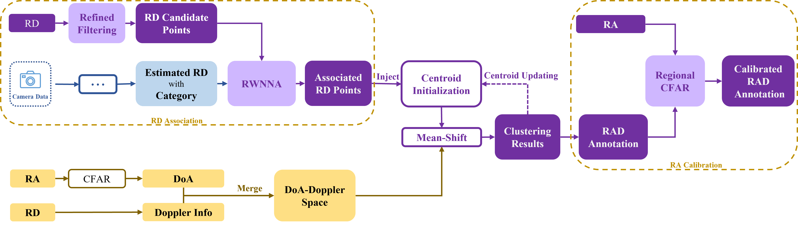

# CARRADA-RAC: RA Annotation Calibration for CARRADA

## This is the annotation calibration pipeline proposed in the paper PeakConv.

[PeakConv: Learning Peak Receptive Field for Radar Semantic Segmentation], CVPR 2023, accepted.

### Pipeline:

Main Contributor for this code: [Xinyan Zhang](https://github.com/zxy1501434265) & [Liwen Zhang](https://github.com/zlw9161)

This repository groups the implemetations of **CARRADA-RAC**.

The code for this pipeline is based on the paper [CARRADA](https://arxiv.org/abs/2005.01456)

If you find this code useful for your research, please cite our paper:
```
@InProceedings{pkc2023,
	       author = {Liwen, Zhang and Xinyan, Zhang and Youcheng, Zhang and Yufei, Guo and Yuanpei, Chen and Xuhui, Huang and Zhe, Ma},
	       title = {PeakConv: Learning Peak Receptive Field for Radar Semantic Segmentation},
	       booktitle = {CVPR 2023 accepted},
	       month = {March},
	       year = {2023}
	       }
```
### The Illustration of CARRADA-RAC annotation:

## Download CARRADA dataset

**Note**: The CARRADA dataset used for this pipeline is considered as already downloaded by default. If it is not the case, you can follow the guidelines of the dedicated [carrada_dataset repository](https://github.com/valeoai/carrada_dataset).

## Running the code

1. **Run the carrada-rac's entire pipeline**:
It is the basic pipeline from carrada, you can skip and directlly skip to step two; 
It is mandatory to specify the path where the CARRADA dataset is located. Example: I put the `Carrada` folder in `/datasets/`, the path I should specify is `/datasets/`. If you are using Docker, the CARRADA dataset is extracted in the `/datasets/` folder by default.
```bash
$ cd scripts/
$ bash run_annotation_pipeline.sh /datasets/
```

2. **Running the first block to get new rd points**:
```bash
$ cd scripts/
$ python generate_rd_points.py
$ python generate_centroids.py
$ python generate_annotation_files.py
```
3. **Running the second block to get best ra points**:
It is the key step to get the new annotations.
```bash
$ cd scripts/
$ python get_best_ra.py
$ python get_new_annotation.py
```

**Note**:if you want to get the old(carrada) annotations:
```bash
$ cd scripts/
$ python get_old_annotation.py
```
## Acknowledgements
- The Soft Dice loss is based on the code from <https://github.com/kornia/kornia/blob/master/kornia/losses/dice.py>
- Thank [CARRADA dataset](https://arxiv.org/abs/2005.01456) for providing the Radar dataset.
- Thank [MVRSS](https://arxiv.org/abs/2103.16214) for providing the basic model framework of multi-view RSS network. And we build our model using the basic framework of `mvrss` lib, our incremental modifications to the  `mvrss` code did not effect the TMVA-Net and MV-Net in MVRSS. 
- The paper is accepted by CVPR 2023. The camera-ready paper for PKC is coming soon, and we will provide the long extension version on arxiv.
## License
The repo is released under the Apache 2.0 license.
